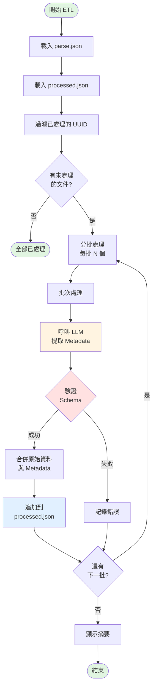

# ETL Pipeline 架構與流程文件

## 1. 概述

ETL Pipeline 負責將原始公告資料（`page.json`）透過 LLM 提取 Metadata，轉換為結構化的 `processed.json`。

**核心特性**：
- ✅ **增量處理**：自動追蹤已處理的 UUID，避免重複
- ✅ **批次處理**：可配置批次大小（預設 10），降低 API 成本
- ✅ **容錯恢復**：中斷後可從未處理的文件繼續
- ✅ **追加寫入**：成功批次立即追加，不覆蓋已有資料

---

## 2. 整體流程圖



---

## 3. 詳細流程說明

### 階段 1：初始化與載入資料

#### 1.1 載入解析資料 (`load_parsed_data()`)
```python
# 從 data/parse.json 載入所有已解析的文件
all_docs = self.load_parsed_data()
```

**職責**：
- 讀取 `parse.json`（由 parser.py 產生）
- 每個文件包含 `uuid`, `title`, `original_content` 等欄位

#### 1.2 載入已處理資料 (`load_processed_data()`)
```python
# 從 data/processed/processed.json 載入已處理的文件
processed_docs = self.load_processed_data()
processed_uuids = {doc.get("uuid") for doc in processed_docs}
```

**職責**：
- 提取所有已處理文件的 UUID
- 用於後續去重

---

### 階段 2：過濾與分批

#### 2.1 過濾已處理文件
```python
unprocessed_docs = [
    doc for doc in all_docs
    if doc.get("uuid") not in processed_uuids
]
```

**邏輯**：
- 比對 UUID，只保留未處理的文件
- 如果全部已處理，直接結束

#### 2.2 分批處理
```python
for i in range(0, len(unprocessed_docs), self.batch_size):
    batch = unprocessed_docs[i : i + self.batch_size]
    batch_index = i // self.batch_size + 1
    # 處理批次...
```

**參數**：
- `batch_size`：預設 10（可透過 `config.py` 的 `DEFAULT_BATCH_SIZE` 調整）
- `batch_index`：批次編號，用於日誌

---

### 階段 3：批次處理 (`BatchProcessor.process_batch()`)

#### 3.1 準備 LLM 輸入 (`prepare_llm_input()`)
```python
llm_input = [
    {
        "id": item.get("uuid"),
        "month": item.get("month"),
        "title": item.get("title"),
        "content": item.get("original_content")
    }
    for item in raw_batch
]
```

**標準化欄位**：
- `id`：使用 UUID 作為唯一識別
- `content`：統一使用 `original_content`

#### 3.2 呼叫 LLM 提取 Metadata (`extract_metadata()`)
```python
batch_result = self.llm_client.call_with_schema(
    messages=[
        {"role": "system", "content": SYSTEM_PROMPT},
        {"role": "user", "content": json.dumps(llm_input)}
    ],
    response_model=BatchMetaExtraction
)
```

**Pydantic Schema 驗證**：
- 使用 `BatchMetaExtraction` 強制驗證輸出格式
- 自動重試機制（LLM Client 內建）
- 失敗時返回 `None`

#### 3.3 合併資料 (`merge_data()`)
```python
docs = self.merge_data(raw_batch, batch_result.results)
```

**合併邏輯**：
- 根據 `id`（UUID）匹配原始資料與 Metadata
- 建立 `AnnouncementDoc` Pydantic 物件
- 包含完整的 `AnnouncementMetadata`

#### 3.4 返回結果
- **成功**：返回 `List[AnnouncementDoc]`
- **失敗**：返回 `None` 並記錄錯誤

---

### 階段 4：增量寫入 (`append_to_processed()`)

```python
if result_docs is not None:
    docs_dict = [doc.model_dump(mode="json") for doc in result_docs]
    self.append_to_processed(docs_dict)
```

**增量寫入邏輯**：
1. 載入現有的 `processed.json` 到記憶體
2. 將新文件追加到列表
3. 一次性寫回文件

**優點**：
- 不會覆蓋已有資料
- 每批成功後立即保存
- 中斷後可繼續

---

### 階段 5：錯誤處理

#### 5.1 錯誤記錄 (`ErrorHandler.log_error()`)

**錯誤類型**：
- `ConfigError`：SYSTEM_PROMPT 為空
- `LLMValidationError`：LLM 輸出驗證失敗
- `MergeError`：合併資料失敗（無輸出）
- `UnexpectedError`：未預期的例外

**記錄內容**：
```json
{
    "batch_file": "batch_1",
    "uuids": ["uuid1", "uuid2", ...],
    "error_type": "LLMValidationError",
    "error_message": "...",
    "llm_input": {...},
    "llm_response": {...}
}
```

#### 5.2 錯誤輸出

**日誌文件**：
- `data/process_log/batch_1.error.json`（詳細錯誤）

**錯誤列表**：
- `data/errorlist.json`（失敗的 UUID 列表）

---

## 4. 核心組件

### 4.1 ETLPipeline (`src/ETL/etl_pipe/etl.py`)

**主控制器**，協調整個 ETL 流程。

**核心方法**：
- `load_parsed_data()`：載入 parse.json
- `load_processed_data()`：載入 processed.json
- `append_to_processed()`：追加新文件
- `genMetaData()`：主流程入口

**初始化參數**：
```python
ETLPipeline(
    parsed_file=PARSE_JSON,           # data/parse.json
    processed_file=PROCESSED_OUTPUT,  # data/processed/processed.json
    log_dir=LOG_DIR,                  # data/process_log
    batch_size=DEFAULT_BATCH_SIZE     # 10
)
```

### 4.2 BatchProcessor (`src/ETL/etl_pipe/batch_processor.py`)

**批次處理器**，處理單一批次的 ETL 邏輯。

**核心方法**：
- `prepare_llm_input()`：標準化輸入格式
- `extract_metadata()`：呼叫 LLM
- `merge_data()`：合併原始資料與 Metadata
- `process_batch()`：完整批次處理流程

### 4.3 ErrorHandler (`src/ETL/etl_pipe/error_handler.py`)

**錯誤處理器**，記錄與追蹤錯誤。

**核心方法**：
- `log_error()`：記錄錯誤到文件
- `has_errors()`：檢查是否有錯誤
- `display_error_summary()`：顯示錯誤摘要
- `save_error_list()`：輸出 errorlist.json

### 4.4 LLMClient (`src/llm/client.py`)

**LLM 客戶端**，封裝 API 呼叫與 Schema 驗證。

**核心方法**：
- `call_with_schema()`：支援 Pydantic Schema 的 API 呼叫
- 自動重試機制（預設 3 次）
- JSON Schema 轉換

---

## 5. 錯誤處理機制

### 5.1 錯誤層級

| 層級 | 描述 | 影響範圍 |
|------|------|----------|
| **批次層級** | 單一批次失敗 | 不影響其他批次 |
| **文件層級** | 單一文件缺少 Metadata | 記錄警告，繼續處理 |
| **系統層級** | SYSTEM_PROMPT 為空 | 中止執行 |

### 5.2 重試機制

**LLM 層級**：
- `LLMClient.call_with_schema()` 自動重試 3 次
- 重試間隔：指數退避

**批次層級**：
- 失敗的批次不會寫入 `processed.json`
- 下次執行時自動重試（因為 UUID 不在 processed 中）

### 5.3 錯誤恢復

**手動恢復**：
```bash
# 查看錯誤
cat data/errorlist.json

# 重新執行 ETL（自動跳過已處理的 UUID）
python src/main.py
```

---

## 6. 配置參數

### 6.1 批次大小

**文件**：`src/config.py`
```python
DEFAULT_BATCH_SIZE = 10  # 每批處理 10 個文件
```

**影響**：
- 越小：API 成本越高，容錯性越好
- 越大：API 成本越低，失敗影響範圍越大

### 6.2 路徑配置

| 配置項 | 預設值 | 說明 |
|--------|--------|------|
| `PARSE_JSON` | `data/parse.json` | 解析後的輸入資料 |
| `PROCESSED_OUTPUT` | `data/processed/processed.json` | 處理後的輸出資料 |
| `LOG_DIR` | `data/process_log` | 錯誤日誌目錄 |
| `ERROR_LIST_OUTPUT` | `data/errorlist.json` | 錯誤 UUID 列表 |

---

## 7. 使用範例

### 7.1 完整流程

```bash
# 步驟 1：解析原始資料
python src/ETL/etl_pipe/parser.py

# 步驟 2：執行 ETL
python src/main.py  # 或其他入口點執行 genMetaData()

# 步驟 3：檢查結果
cat data/processed/processed.json
cat data/errorlist.json  # 若有錯誤
```

### 7.2 增量處理範例

**場景**：已處理 100 個文件，新增 20 個文件

```bash
# 重新解析（產生新的 parse.json，包含 120 個文件）
python src/ETL/etl_pipe/parser.py

# 執行 ETL（自動只處理新增的 20 個）
python src/main.py
```

**輸出**：
```
Total documents: 120
Already processed: 100
To process: 20
Batch size: 10

[Batch 1/2]
Processing batch 1 (10 items)...
✓ Batch 1 processed successfully (10 docs)
✓ Appended 10 documents to processed.json (total: 110)

[Batch 2/2]
Processing batch 2 (10 items)...
✓ Batch 2 processed successfully (10 docs)
✓ Appended 10 documents to processed.json (total: 120)
```

### 7.3 錯誤恢復範例

**場景**：第 5 批次失敗，前 4 批次已成功

```bash
# 重新執行（自動跳過前 4 批次，重試第 5 批次）
python src/main.py
```

**系統邏輯**：
1. 載入 `processed.json`（包含前 40 個文件）
2. 過濾出未處理的文件（從第 41 個開始）
3. 重新處理第 5 批次（第 41-50 個文件）

---

## 8. 技術細節

### 8.1 UUID 生成

**時機**：在 `parser.py` 解析時生成
```python
import uuid
doc["uuid"] = str(uuid.uuid4())
```

### 8.2 Pydantic Schema

**資料流**：
```
Raw JSON → AnnouncementDoc (無 Metadata)
         ↓
    LLM 處理
         ↓
MetadataExtraction → AnnouncementMetadata
         ↓
    合併
         ↓
AnnouncementDoc (完整)
```

### 8.3 記憶體管理

**策略**：
- 批次處理避免一次載入所有資料到記憶體
- 成功批次立即寫入，釋放記憶體
- `append_to_processed()` 會重新讀取整個 `processed.json`（但僅在寫入時）

---

## 9. 常見問題

### Q1: 如何調整批次大小？

**修改** `src/config.py`：
```python
DEFAULT_BATCH_SIZE = 20  # 改為 20
```

### Q2: 如何重置處理進度？

**刪除** `processed.json`：
```bash
rm data/processed/processed.json
# 重新執行會從頭開始處理
python src/main.py
```

### Q3: 如何只處理錯誤的文件？

**方法 1**（推薦）：
```bash
# 直接重新執行，系統會自動跳過已處理的 UUID
python src/main.py
```

**方法 2**（需實作）：
- 新增 `retry_errors()` 方法
- 讀取 `errorlist.json`
- 從 `parse.json` 過濾出對應文件

### Q4: 如何查看錯誤詳情？

**查看詳細錯誤日誌**：
```bash
cat data/process_log/batch_5.error.json
```

**查看錯誤 UUID 列表**：
```bash
cat data/errorlist.json
```

---

## 10. 未來優化方向

- [ ] 實作 `retry_errors()` 方法，專門處理失敗的批次
- [ ] 增加進度條顯示（使用 `tqdm`）
- [ ] 支援平行批次處理（多執行緒）
- [ ] 支援斷點續傳（記錄當前處理位置）
- [ ] 增加統計報表（處理速度、成功率等）
