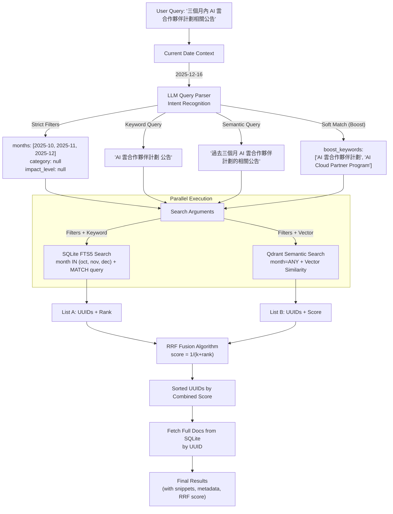

# Hybrid Search Flow (Phase 4)

## Architecture Overview



## Key Components

### 1. LLM Query Parser
- **Input**: User query + Current date
- **Output**: Structured SearchIntent
  - `filters` (strict): months, category, impact_level
  - `keyword_query`: Optimized for FTS5
  - `semantic_query`: Optimized for vector search
  - `boost_keywords`: Soft-match terms (不強制過濾)

### 2. Filter Strategy
- **Strict Filters** (MUST match):
  - Time range (months list)
  - Category
  - Impact level

- **Soft Boost** (加分但不過濾):
  - Product names
  - Technical terms
  - Brand names

### 3. Database Adapters
- **SQLite**: FTS5 with metadata filters
  - `month IN (...)` for multi-month support
  - No products filtering

- **Qdrant**: Vector search with payload filters
  - `MatchAny(any=months)` for date ranges
  - No products filtering

### 4. RRF Fusion
- Combines results from both sources
- Formula: `score = 1 / (k + rank)` where k=60
- Handles single-source and dual-source matches

## Example Queries

### Query 1: Time Range + Product Mention
```
Input: "三個月內「AI 雲合作夥伴計劃」相關公告"
Output:
  - months: ["2025-10", "2025-11", "2025-12"]
  - boost_keywords: ["AI 雲合作夥伴計劃"]
  - Result: 返回三個月內所有公告，提及該產品的排序更高
```

### Query 2: Strict Filters
```
Input: "過去兩個月的高影響力安全公告"
Output:
  - months: ["2025-11", "2025-12"]
  - category: "Security"
  - impact_level: "High"
  - Result: 僅返回符合所有條件的公告
```

### Query 3: Soft Match Only
```
Input: "Azure OpenAI pricing details"
Output:
  - months: []
  - category: "Pricing"
  - boost_keywords: ["Azure OpenAI"]
  - Result: 所有價格公告，提及 Azure OpenAI 的優先
```

## Benefits of This Architecture

1. **智能時間解析**: "三個月內" 自動展開為月份列表
2. **彈性匹配**: Products 作為加分項而非過濾器
3. **並行搜尋**: SQLite FTS + Qdrant 同時執行
4. **結果融合**: RRF 演算法平衡兩種搜尋策略
5. **上下文感知**: LLM 能根據當前日期計算相對時間
