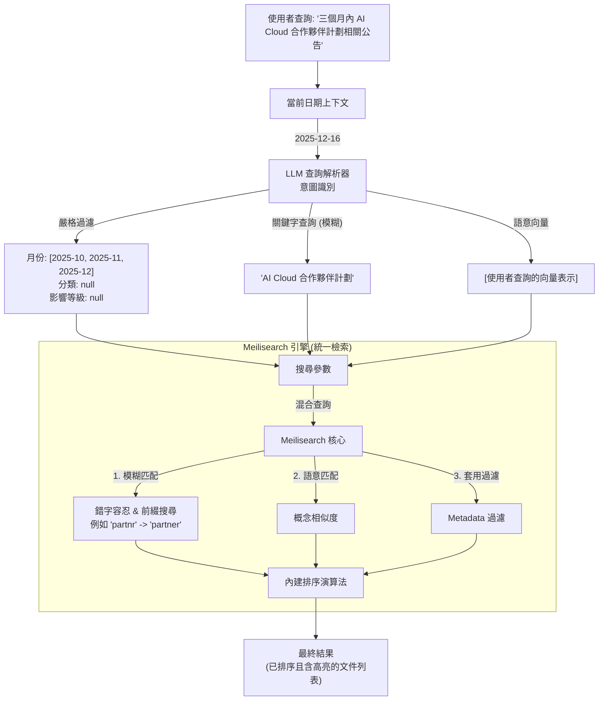

# 混合檢索流程 (Hybrid Search Flow - Meilisearch 版)

## 架構概觀 (Architecture Overview)



## 關鍵組件 (Key Components)

### 1. LLM 查詢解析器 (Query Parser)
- **輸入**: 使用者查詢 + 當前日期
- **輸出**: 結構化的 `SearchIntent`
  - `filters` (嚴格): 月份範圍、分類、影響等級。
  - `keyword_query`: 提取出的關鍵詞 (如 "AI Cloud") - **直接支援模糊匹配**。
  - `semantic_query`: (選用) 用於生成查詢向量，啟動混合搜尋。

### 2. 搜尋策略 (Meilisearch Strategy)
- **模糊搜尋 (Fuzzy Search)**:
  - **錯字容忍 (Typo Tolerance)**: 自動處理拼寫錯誤 (例如 `Micosoft` -> `Microsoft`)。
  - **前綴匹配 (Prefix Matching)**: 支援未完成的詞彙 (例如 `CSP*` 可匹配 `CSP-Reseller`)。
  - **CJK 支援**: 內建中文分詞，能處理中英混合的查詢字串。

- **嚴格過濾 (Strict Filters)**:
  - 將 LLM 解析結果轉換為 Meilisearch 過濾語法：
    `month IN ['2025-10', ...] AND metadata.category = 'Security'`

- **混合搜尋 (Hybrid Search)**:
  - 無縫結合關鍵字分數 (類 BM25) 與向量相似度分數，自動計算最佳排序。

### 3. 資料庫轉接器 (`db_adapter_meili.py`)
- 系統與搜尋引擎的唯一溝通窗口。
- 負責將 `SearchIntent` 轉換為 Meilisearch API 呼叫：
  ```python
  index.search(
      query="AI Cloud", 
      filter="month IN ['2025-11']", 
      hybrid={"semanticRatio": 0.5}  # 關鍵字與語意權重各半
  )
  ```

## 查詢範例 (Example Queries)

### 範例 1：時間範圍 + 模糊產品名稱
```
輸入: "三個月內 AI Clud 合作夥伴計劃" (注意錯字: 'Clud')
輸出:
  - filters: "month IN ['2025-10', '2025-11', '2025-12']"
  - query: "AI Clud 合作夥伴計劃"
  - 結果: 
    - 自動修正 'Clud' -> 'Cloud'。
    - 僅返回指定月份內的公告。
    - 將 "AI Cloud Partner Program" 相關度最高的文件排在前面。
```

### 範例 2：嚴格過濾 + 語意概念
```
輸入: "過去兩個月的高影響力安全公告"
輸出:
  - filters: "month IN ['2025-11', '2025-12'] AND metadata.category = 'Security' AND metadata.impact_level = 'High'"
  - query: "安全公告" (同時使用向量搜尋)
  - 結果: 嚴格篩選出 11、12 月且標記為 High Impact 的 Security 類別公告。
```

### 範例 3：英文關鍵字與軟性匹配
```
輸入: "Azure OpenAI pricing details"
輸出:
  - filters: "metadata.category = 'Pricing'"
  - query: "Azure OpenAI"
  - 結果: 返回所有價格類公告，標題或內容含有 "Azure OpenAI" 的優先排序。
```

## 新架構優勢 (Benefits)

1.  **架構簡化**: 不需同時維護 SQLite 和 Qdrant 兩套資料庫。
2.  **原生模糊搜尋**: 內建錯字容忍與中文分詞，無需複雜的 ETL 預處理。
3.  **統一排序**: 不需要手寫 RRF 融合演算法，引擎自動處理分數加權。
4.  **高效能**: 基於記憶體的高速搜尋，優化使用者體驗。
5.  **上下文感知**: 保留 LLM 的智慧解析能力，精準處理日期與意圖。