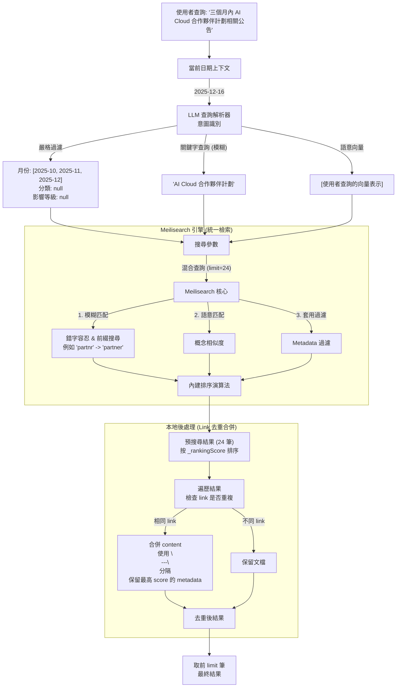

# 混合檢索流程 (Hybrid Search Flow - Meilisearch 版)

## 架構概觀 (Architecture Overview)

## 去重合併邏輯 (Deduplication & Merge)

為避免文檔切塊後同一網頁重複出現在搜尋結果中，系統採用以下策略：

1. **預搜尋 (Pre-search)**：向 Meilisearch 請求 24 筆結果（可在 `config.PRE_SEARCH_LIMIT` 配置）
2. **合併重複 link**：
   - 遍歷已按 `_rankingScore` 降序排序的結果
   - 遇到相同 `link` 時，將後續文檔的 `content` 拼接至第一個出現的文檔
   - 拼接格式：`content1 + "\n---\n" + content2`
   - 保留最高 score 文檔的所有 metadata (title, year_month, workspace, _rankingScore 等)
3. **截取最終結果**：從去重後的文檔列表中取前 `limit` 筆返回

此設計確保用戶看到的是不同網頁的搜尋結果，而非同一網頁的多個片段，提升搜尋體驗與結果多樣性。
