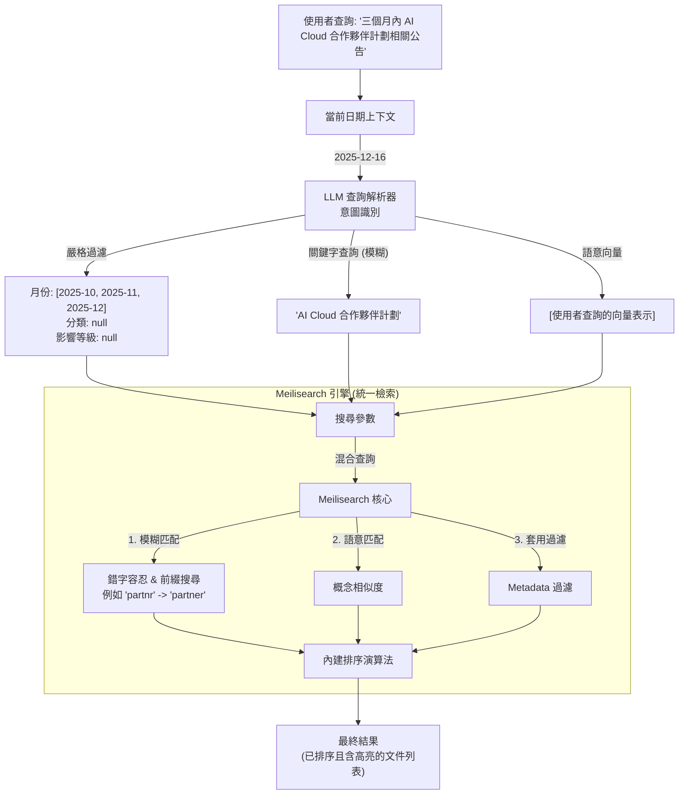

# 混合檢索流程 (Hybrid Search Flow - Meilisearch 版)

## 架構概觀 (Architecture Overview)



## 關鍵組件 (Key Components)

### 1. LLM 查詢解析器 (Query Parser)
- **輸入**: 使用者查詢 + 當前日期
- **輸出**: 結構化的 `SearchIntent`
  - `filters` (嚴格): 月份範圍、分類、影響等級。
  - `keyword_query`: 提取出的關鍵詞 (如 "AI Cloud") - **直接支援模糊匹配**。
  - `semantic_query`: (選用) 用於生成查詢向量，啟動混合搜尋。

### 2. 搜尋策略 (Meilisearch Strategy)

#### 2.1 模糊搜尋 (Fuzzy Search) - 權重 50%
- **搜索欄位** (依權重排序):
  ```python
  searchable_attributes = [
      "title",                    # ① 權重最高
      "content",                  # ② 權重中等
      "metadata.meta_summary"     # ③ 權重最低（LLM 生成的繁體中文摘要）
  ]
  ```

- **Ranking Rules** (依序計算分數):
  1. **words**: 匹配查詢中的詞彙數量
  2. **typo**: 錯字容忍（英文最多 2 字符差異，例如 `Micosoft` -> `Microsoft`）
  3. **proximity**: 詞彙在文檔中的接近度
  4. **attribute**: 欄位權重（title > content > meta_summary）
  5. **exactness**: 精確匹配獎勵

- **分詞機制**:
  - **英文**: 按空格和標點符號分詞（"Azure OpenAI" → ["Azure", "OpenAI"]）
  - **中文**: ⚠️ **Character-level tokenization**（"價格調整" → ["價", "格", "調", "整"]）
  - **限制**: 不是專業的中文分詞（如 jieba），精準度有限
  - **彌補方式**: `meta_summary` 提供繁體中文內容，部分緩解此問題

#### 2.2 語義搜尋 (Semantic Search) - 權重 50%
- **向量化內容** (來自 `vector_utils.py:create_enriched_text`):
  ```python
  text = f"Title: {title}\n" +
         f"Impact Level: {meta_impact_level}\n" +      # metadata
         f"Target Audience: {meta_audience}\n" +       # metadata
         f"Products: {meta_products}\n" +              # metadata ← 注意！
         f"Change Type: {meta_change_type}\n" +        # metadata
         f"Summary: {meta_summary}\n" +                # metadata
         f"Content: {original_content}"                # content
  # 編碼為 1024 維向量（bge-m3 model）
  ```

- **特點**:
  - 所有 metadata 都被編碼到向量中
  - 能理解語義相似性（"price change" ≈ "價格調整"）
  - 跨語言匹配（中文查詢 ↔ 英文 content）

#### 2.3 混合分數計算
```python
final_score = (1 - semantic_ratio) × keyword_score + semantic_ratio × semantic_score
            = 0.5 × keyword_score + 0.5 × semantic_score  # 預設各半
```

#### 2.4 嚴格過濾 (Strict Filters)
- 將 LLM 解析結果轉換為 Meilisearch 過濾語法：
  ```
  month IN ['2025-10', ...] AND metadata.meta_category = 'Security'
  ```
- **可過濾欄位**:
  - `month`: 公告月份（常用）
  - `metadata.meta_category`: 公告類別（常用）
  - `metadata.meta_impact_level`: 影響等級（常用）
  - `metadata.meta_products`: ⚠️ 已配置但未使用
  - `metadata.meta_audience`: ⚠️ 已配置但未使用

### 3. 資料庫轉接器 (`db_adapter_meili.py`)
- 系統與搜尋引擎的唯一溝通窗口。
- 負責將 `SearchIntent` 轉換為 Meilisearch API 呼叫：
  ```python
  index.search(
      query="AI Cloud",                      # 用於關鍵字搜索
      vector=query_vector,                   # 1024 維查詢向量
      filter="month IN ['2025-11']",         # 嚴格過濾條件
      hybrid={"semanticRatio": 0.5},         # 50% 關鍵字 + 50% 語義
      showRankingScore=True                  # 返回 0.0-1.0 的排名分數
  )
  ```

### 4. Metadata 在兩種搜索中的角色

| Metadata 欄位 | 關鍵字搜索 | 向量搜索 | 過濾功能 | 實際使用狀態 |
|--------------|-----------|---------|---------|-------------|
| `meta_summary` | ✅ 參與（低權重） | ✅ 參與 | ❌ | ✅ 充分利用 |
| `meta_products` | ❌ 不參與 | ✅ 參與 | ✅ 可用 | ⚠️ 過濾未用，僅靠向量 |
| `meta_audience` | ❌ 不參與 | ✅ 參與 | ✅ 可用 | ⚠️ 過濾未用，僅靠向量 |
| `meta_category` | ❌ 不參與 | ✅ 參與 | ✅ 可用 | ✅ 過濾常用 |
| `meta_impact_level` | ❌ 不參與 | ✅ 參與 | ✅ 可用 | ✅ 過濾常用 |
| `meta_change_type` | ❌ 不參與 | ✅ 參與 | ❌ | ⚠️ 僅向量搜索 |

**關鍵發現：**
- **`meta_summary`** 是唯一同時參與兩種搜索的 metadata，價值極高
- **`meta_products`** 只能靠向量搜索匹配，無法獲得關鍵字精確匹配的高分
- **boost_keywords** 已由 LLM 生成但**未被使用**（功能缺口）

## 查詢範例 (Example Queries)

### 範例 1：時間範圍 + 產品名稱
```
輸入: "三個月內 AI Clud 合作夥伴計劃" (注意錯字: 'Clud')

LLM 解析結果:
  - filters: {months: ['2025-10', '2025-11', '2025-12']}
  - keyword_query: "AI Clud 合作夥伴計劃"
  - semantic_query: "過去三個月 AI Cloud 合作夥伴計劃的相關公告"
  - boost_keywords: ["AI 雲合作夥伴計劃"] (⚠️ 未使用)

Meilisearch 執行:
  - 關鍵字搜索 (50%):
    - 英文 "Clud" 透過 typo tolerance 自動修正為 "Cloud"
    - 中文 "合作夥伴計劃" 被拆為 ["合", "作", "夥", "伴", "計", "劃"]
    - 在 title/content/meta_summary 中查找匹配

  - 向量搜索 (50%):
    - semantic_query 編碼為向量
    - 計算與文檔向量的相似度
    - meta_products 中的 "AI Cloud Partner Program" 會提升相似度

  - 過濾: 僅返回 2025-10/11/12 三個月的公告

最終結果: 返回三個月內的相關公告，按混合分數排序
```

### 範例 2：嚴格過濾 + 多條件
```
輸入: "過去兩個月的高影響力安全公告"

LLM 解析結果:
  - filters: {
      months: ['2025-11', '2025-12'],
      category: 'Security',
      impact_level: 'High'
    }
  - keyword_query: "高影響 安全性 公告"
  - semantic_query: "2025年11月和12月的高影響安全性公告"

Meilisearch 執行:
  - 關鍵字搜索:
    - 中文 "高影響" "安全性" "公告" 被字符級分詞
    - 在 title/content/meta_summary 中查找

  - 向量搜索:
    - 語義理解 "high impact security announcements"
    - meta_impact_level="High" 和 meta_category="Security"
      已編碼在向量中，會提升相似度

  - 過濾:
    month IN ['2025-11', '2025-12'] AND
    metadata.meta_category = 'Security' AND
    metadata.meta_impact_level = 'High'

最終結果: 嚴格篩選出符合所有條件的公告
```

### 範例 3：產品名稱查詢的挑戰
```
輸入: "Azure OpenAI pricing details"

LLM 解析結果:
  - filters: {category: 'Pricing'}
  - keyword_query: "Azure OpenAI 價格"
  - semantic_query: "Azure OpenAI 的價格詳細資訊"
  - boost_keywords: ["Azure OpenAI"] (⚠️ 未使用)

Meilisearch 執行:
  - 關鍵字搜索:
    - "Azure" 和 "OpenAI" 在 title/content/meta_summary 中查找
    - ⚠️ meta_products 中的 "Azure OpenAI" 不會被匹配
    - "價格" 被拆為 ["價", "格"]

  - 向量搜索:
    - ✅ meta_products 中的 "Azure OpenAI" 會影響向量相似度
    - 語義理解 "pricing" ≈ "價格"

  - 過濾: metadata.meta_category = 'Pricing'

最終結果: 返回價格類公告，但產品名稱匹配主要靠向量搜索（50%權重）
⚠️ 問題: 如果 title/content 沒有直接提到 "Azure OpenAI"，
         僅靠 meta_products，無法獲得關鍵字搜索的高分
```

## 新架構優勢 (Benefits)

1.  **架構簡化**: 不需同時維護 SQLite 和 Qdrant 兩套資料庫。
2.  **原生模糊搜尋**: 內建錯字容忍與中文分詞，無需複雜的 ETL 預處理。
3.  **統一排序**: 不需要手寫 RRF 融合演算法，引擎自動處理分數加權。
4.  **高效能**: 基於記憶體的高速搜尋，優化使用者體驗。
5.  **上下文感知**: 保留 LLM 的智慧解析能力，精準處理日期與意圖。