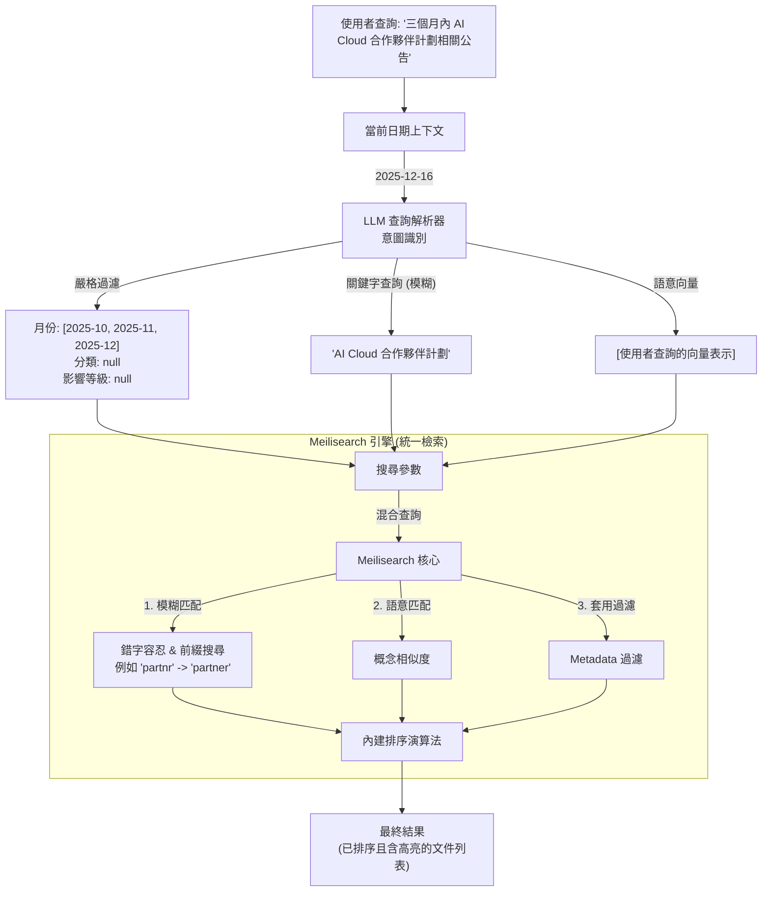

# 混合檢索流程 (Hybrid Search Flow - Meilisearch 版)

## 架構概觀 (Architecture Overview)

```mermaid
graph TD
    User["使用者查詢: '三個月內 AI Cloud 合作夥伴計劃相關公告'"] --> Context[當前日期上下文]
    Context -->|"2025-12-16"| LLM[LLM 查詢解析器<br/>意圖識別]

    LLM -->|"嚴格過濾"| Filters["月份: [2025-10, 2025-11, 2025-12]<br/>分類: null<br/>影響等級: null"]
    LLM -->|"關鍵字查詢 (模糊)"| KeywordQ["'AI Cloud 合作夥伴計劃'"]
    LLM -->|"語意向量"| VectorQ["[使用者查詢的向量表示]"]
    
    Filters & KeywordQ & VectorQ --> SearchArgs[搜尋參數]

    subgraph "Meilisearch 引擎 (統一檢索)"
        SearchArgs -->|混合查詢| Engine[Meilisearch 核心]
        
        Engine -->|1. 模糊匹配| KeywordResult[錯字容忍 & 前綴搜尋<br/>例如 'partnr' -> 'partner']
        Engine -->|2. 語意匹配| VectorResult[概念相似度]
        Engine -->|3. 套用過濾| FilterResult[Metadata 過濾]
        
        KeywordResult & VectorResult & FilterResult --> Ranking[內建排序演算法]
    end

    Ranking --> Final["最終結果<br/>(已排序且含高亮的文件列表)"]
```
