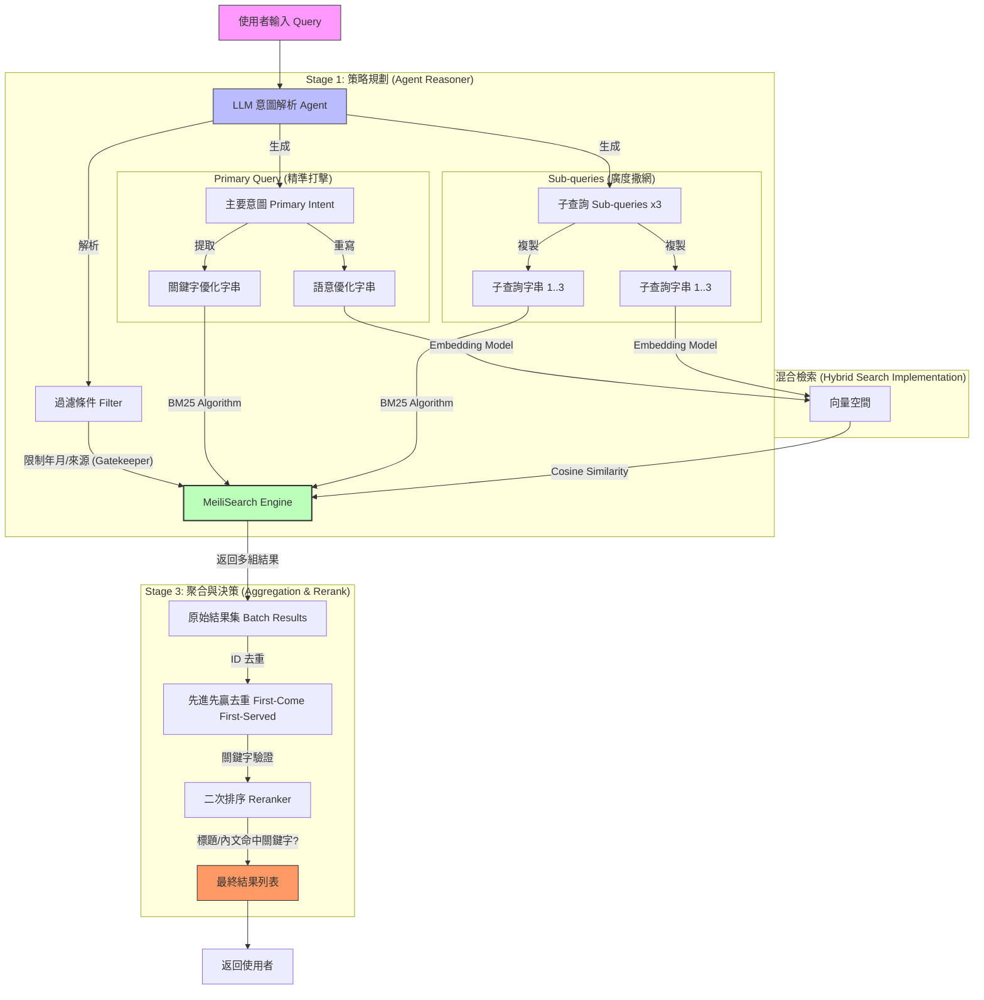

# 搜尋流程架構 (Search Architecture)

## 核心概念：精準與廣度的雙重奏

我們的搜尋系統採用 **Agentic Search** 架構，旨在解決傳統關鍵字搜尋「不夠聰明」與單純向量搜尋「不夠精確」的問題。系統將使用者的查詢視為一個「意圖 (Intent)」，並透過兩個層次來處理：

1.  **精準打擊 (Primary Query)**：針對使用者的核心問題，使用最高規格的「雙軌優化」——同時生成最適合傳統搜尋引擎的關鍵字，以及最適合 AI 理解的自然語言句子。
2.  **廣度撒網 (Sub-queries)**：預判使用者可能感興趣的相關領域或不同問法，生成多個子查詢來擴大搜索範圍，確保不會遺漏邊緣資訊。

這兩者並行運作，最終通過智慧去重與二次排序，呈現給使用者最相關的結果。

## 流程圖 (Process Flow)

## 關鍵機制說明

1.  **過濾器作為門神 (Filter as Gatekeeper)**：
    LLM 解析出的時間（如「最近三個月」）或來源限制，會被轉換為絕對的過濾條件。這意味著無論內容相似度多高，只要不符合過濾條件（如年份不對），就絕對不會出現在結果中。這是確保資料正確性的第一道防線。

2.  **雙重優化策略 (Asymmetric Optimization)**：
    *   **主查詢**享有「頂級待遇」：關鍵字與向量分別客製化，確保精準度。
    *   **子查詢**採取「經濟策略」：同一組詞彙同時用於兩種搜尋，主打覆蓋率與聯想力。

3.  **先進先贏的去重機制 (First-Come First-Served)**：
    系統優先信任「主查詢」找到的結果。如果「主查詢」和「子查詢」找到了同一篇文章，系統會保留主查詢的版本（包含其分數與排名），並丟棄子查詢重複找到的，確保核心意圖的優先權。
