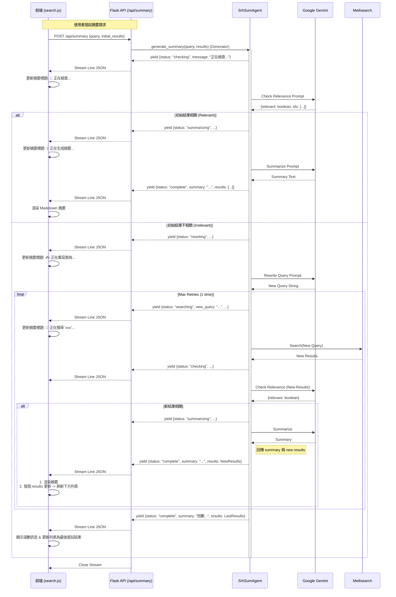

# Agentic Search & Summary Streaming Flow

## 核心流程 (Core Workflow)

本系統採用 **Server-Sent Events (SSE) 風格的 NDJSON 串流** 技術，實現後端 Agent 思考過程的即時視覺化。

### 循序圖 (Sequence Diagram)

## 狀態定義 (State Definitions)

| 狀態代碼 (`status`) | UI 行為 | 說明 |
| :--- | :--- | :--- |
| `checking` | 顯示 **🧐 正在檢查...** (Bounce動畫) | Agent 正在評估目前的搜尋結果是否足以回答使用者的問題。 |
| `rewriting` | 顯示 **✍️ 正在重寫...** (Pulse動畫) | 初始結果品質不佳，Agent 正在根據語意生成更好的關鍵字。 |
| `searching` | 顯示 **🔄 正在搜尋...** (Spin動畫) | 使用新的關鍵字向 Meilisearch 發起查詢。 |
| `summarizing` | 顯示 **💡 正在總結...** (Pulse動畫) | 資料充足，正在呼叫 LLM 進行最終的摘要寫作。 |
| `complete` | 顯示 **最終結果** | 流程結束。回傳 Markdown 格式摘要，若有新搜尋結果則一併回傳。 |
