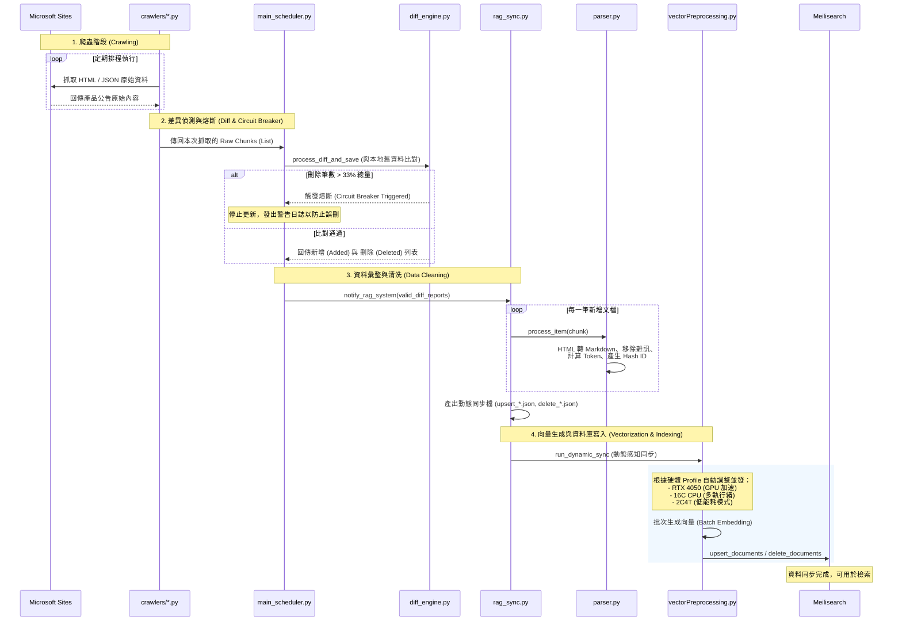

# 資料預處理與同步流程 (Data ETL Pipeline)

本圖表描述資料從「原始網站」獲取、清洗、差異偵測，直到「向量化」並寫入 Meilisearch 的完整自動化路徑。

## 核心組件說明

| 組件 | 職責 |
| :--- | :--- |
| **Crawlers** | 針對不同來源（Azure, M365, Partner Center）的客製化抓取邏輯。 |
| **Diff Engine** | 核心穩定性偵測，確保系統不會因爬蟲失效而清空現有資料（熔斷機制）。 |
| **Data Parser** | 清理廣告、社群連結與樣板代碼，並將長度標準化，是 RAG 品質的關鍵。 |
| **Vector Processor** | 實現「硬體感知」的非同步向量生成，在不同運算資源下都能快速重建索引。 |
